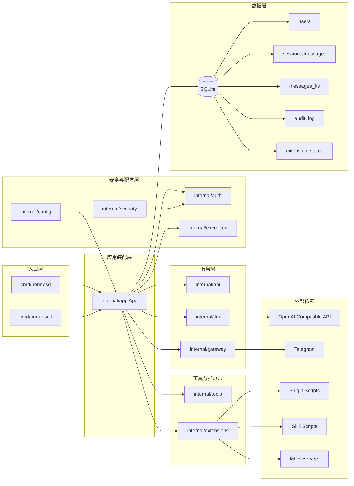
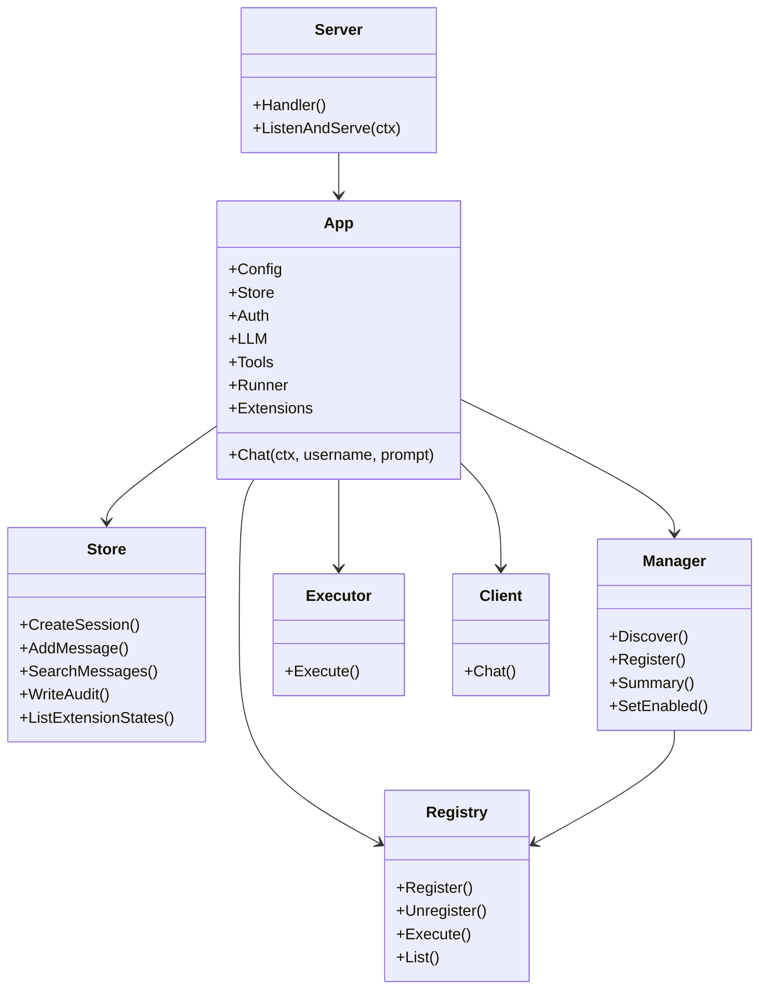
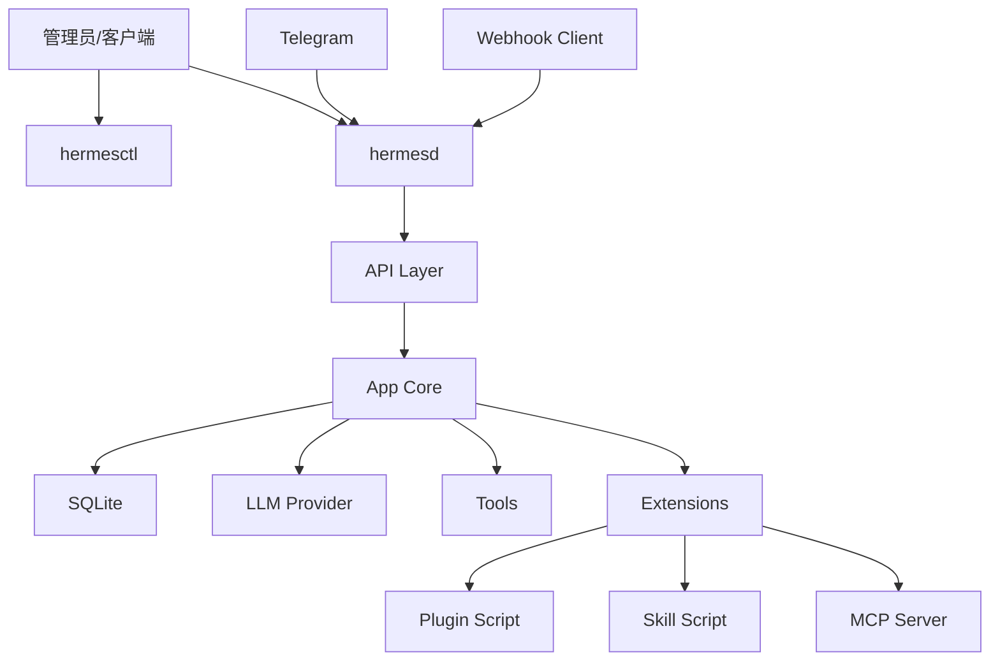

# Go 版本设计图

## 总体设计图

## 核心设计原则

### 1. 单一装配中心

所有核心能力都通过 `internal/app.App` 汇总，避免像 Python 版本那样散落在多个运行时注册点。

### 2. 接口入口统一

无论来自：

- HTTP API
- Webhook
- Telegram
- Tool 调用
- Extension 调用

最终都尽量回到统一的 `App` 和 `Store` 边界。

### 3. 高风险能力单独围栏

把高风险执行链单独放在：

- `internal/execution`
- `internal/extensions`

这样可以明确哪些能力需要审批、白名单、审计和后续沙箱。

### 4. 扩展优先“可治理”

Go 版本对动态扩展的设计不是追求最大自由，而是追求：

1. 可发现
2. 可启停
3. 可审计
4. 可限制
5. 可后续替换成更强实现

## 模块关系图

## 部署设计图

## 当前设计的优点

- 结构清晰，入口统一
- 安全边界明确
- 状态与审计集中
- 容易继续向更多 Slack 能力、更多 MCP transport、更多 gateway 扩展

## 当前设计的限制

- 还不是完整的多轮 agent orchestration
- MCP 目前已支持 `stdio` 与受控 `http`，但还没有更完整的 streamable HTTP / 长连接 transport
- plugin / skill 目前是受控命令模板，不是完整生命周期插件系统
- 复杂动态执行链仍然保守收口
