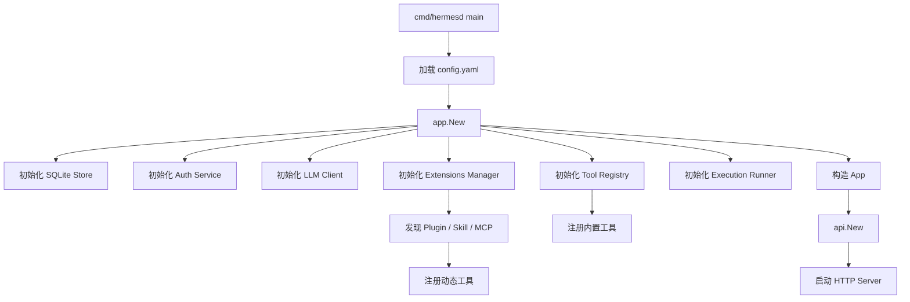
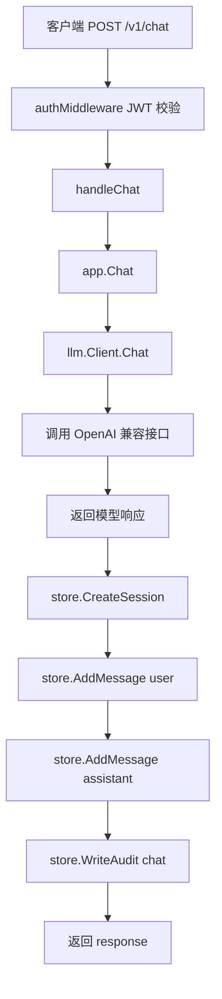
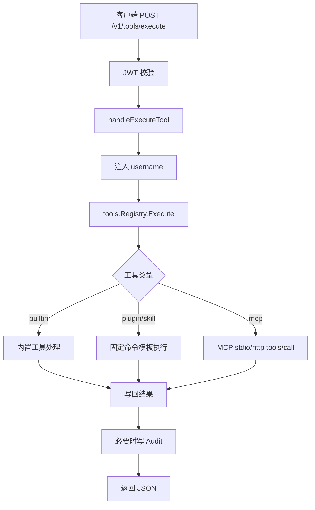
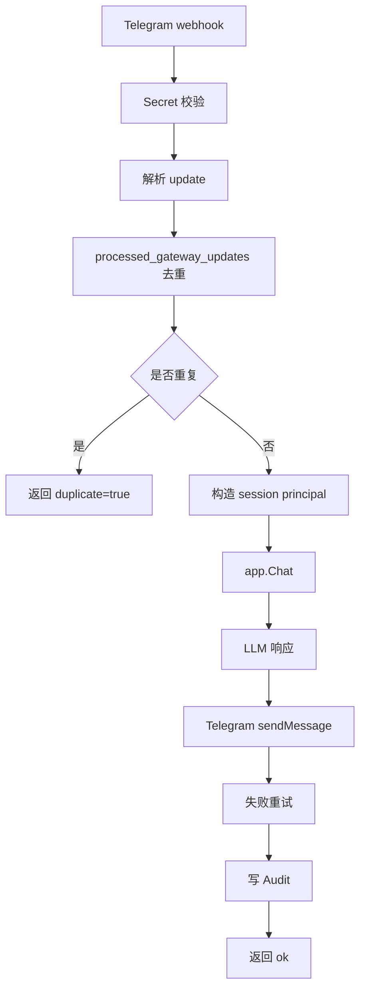
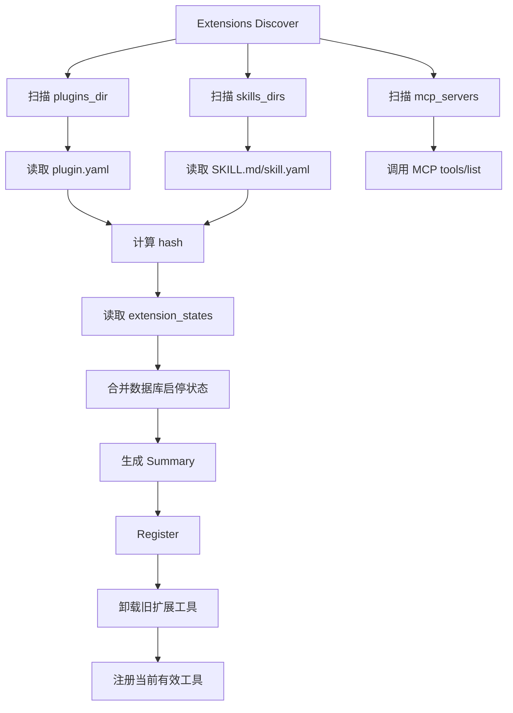

# Go 版本执行流程图

## 1. 服务启动流程

```mermaid
flowchart TD
    A[cmd/hermesd main] --> B[加载 config.yaml]
    B --> C[app.New]
    C --> D[初始化 SQLite Store]
    C --> E[初始化 Auth Service]
    C --> F[初始化 LLM Client]
    C --> G[初始化 Tool Registry]
    C --> H[初始化 Extensions Manager]
    C --> I[初始化 Execution Runner]
    H --> J[发现 Plugin / Skill / MCP]
    J --> K[注册动态工具]
    G --> L[注册内置工具]
    C --> M[构造 App]
    M --> N[api.New]
    N --> O[启动 HTTP Server]
```

## 2. Chat 请求执行流程

```mermaid
flowchart TD
    A[客户端 POST /v1/chat] --> B[authMiddleware JWT 校验]
    B --> C[handleChat]
    C --> D[app.Chat]
    D --> E[llm.Client.Chat]
    E --> F[调用 OpenAI 兼容接口]
    F --> G[返回模型响应]
    G --> H[store.CreateSession]
    H --> I[store.AddMessage user]
    I --> J[store.AddMessage assistant]
    J --> K[store.WriteAudit chat]
    K --> L[返回 response]
```

## 3. Tool 执行流程

```mermaid
flowchart TD
    A[客户端 POST /v1/tools/execute] --> B[JWT 校验]
    B --> C[handleExecuteTool]
    C --> D[注入 username]
    D --> E[tools.Registry.Execute]
    E --> F{工具类型}
    F -->|builtin| G[内置工具处理]
    F -->|plugin/skill| H[固定命令模板执行]
    F -->|mcp| I[MCP stdio/http tools/call]
    G --> J[写回结果]
    H --> J
    I --> J
    J --> K[必要时写 Audit]
    K --> L[返回 JSON]
```

## 4. Telegram Gateway 流程

```mermaid
flowchart TD
    A[Telegram webhook] --> B[Secret 校验]
    B --> C[解析 update]
    C --> D[processed_gateway_updates 去重]
    D --> E{是否重复}
    E -->|是| F[返回 duplicate=true]
    E -->|否| G[构造 session principal]
    G --> H[app.Chat]
    H --> I[LLM 响应]
    I --> J[Telegram sendMessage]
    J --> K[失败重试]
    K --> L[写 Audit]
    L --> M[返回 ok]
```

## 5. 扩展发现与治理流程

```mermaid
flowchart TD
    A[Extensions Discover] --> B[扫描 plugins_dir]
    A --> C[扫描 skills_dirs]
    A --> D[扫描 mcp_servers]
    B --> E[读取 plugin.yaml]
    C --> F[读取 SKILL.md/skill.yaml]
    D --> G[调用 MCP tools/list]
    E --> H[计算 hash]
    F --> H
    H --> I[读取 extension_states]
    I --> J[合并数据库启停状态]
    J --> K[生成 Summary]
    K --> L[Register]
    L --> M[卸载旧扩展工具]
    M --> N[注册当前有效工具]
```
