# Go Hermes 模块架构与时序

本文按模块解释：

- 这个模块负责什么
- 为什么把它单独做成一个模块
- 模块内采用什么方案
- 模块和外部如何协作
- 它对应 Python 的哪些能力

---

## 1. `cmd/hermesctl`

### 职责

- 管理员初始化
- 登录与 token 获取
- 模型查看、发现、切换
- CLI 单轮或交互式对话

### 架构图

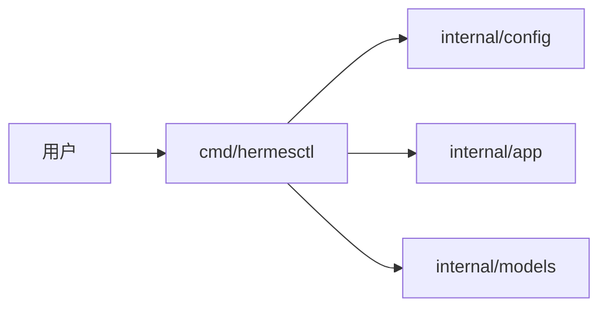

### 时序图

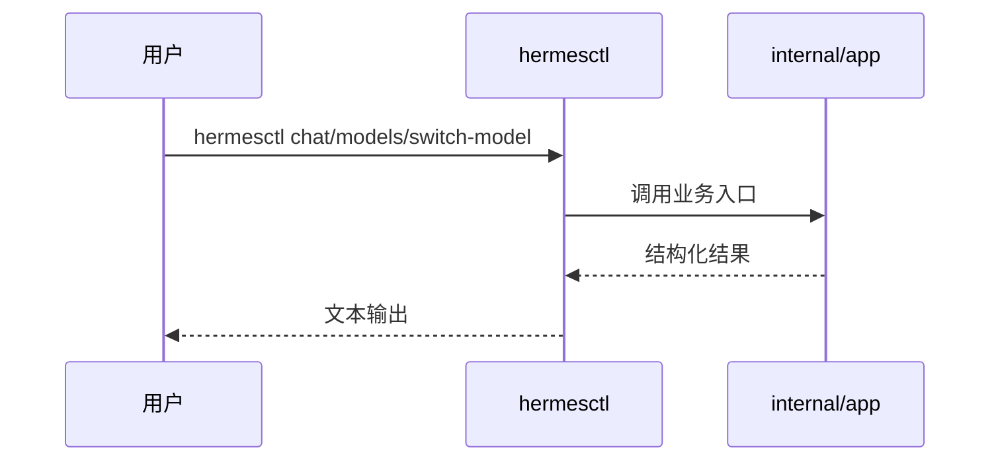

### 为什么这样设计

- 把运维和交互都放到 CLI，符合轻量版目标
- 用户不需要先启动 Web UI 才能完成基本管理

### Python 对应

- `cli.py`
- `hermes_cli/main.py`
- `hermes_cli/model_switch.py`
- `hermes_cli/models.py`

---

## 2. `cmd/hermesd` + `internal/api`

### 职责

- 启动 HTTP 服务
- 提供 chat、memory、models、tools、extensions、multiagent、audit 等 API
- 挂载 gateway webhook 入口

### 架构图

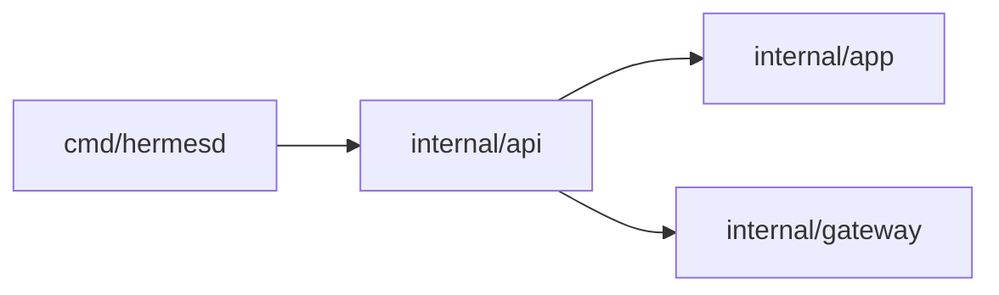

### 时序图

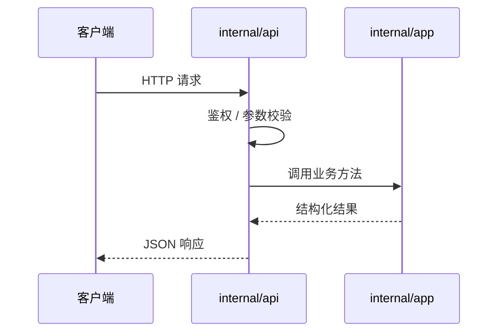

### 为什么这样设计

- API 只做边界控制
- 业务编排不散落在 handler 里

### Python 对应

- Python API server 路线
- gateway 入口的部分 REST / webhook 行为

---

## 3. `internal/app`

### 职责

- 应用装配
- chat 主链
- model switch
- memory 读写
- multiagent 计划、运行、回放、恢复
- 扩展发现与注册协同

### 架构图

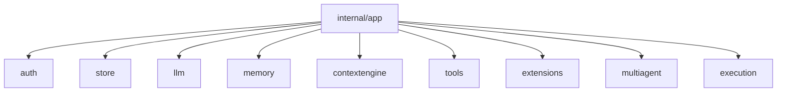

### 时序图

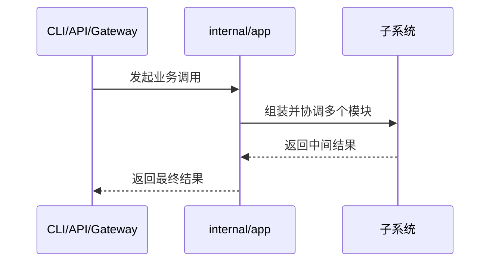

### 为什么这样设计

- Go 版要易理解，必须有一个明确的“业务总装层”
- 避免 handler、tool、gateway 各自偷偷协调状态

### Python 对应

- `run_agent.py`
- `cli.py`
- `model_tools.py` 的一部分协调逻辑

---

## 4. `internal/store`

### 职责

- 用户、session、messages
- audit
- multiagent trace
- extension hook runs
- 搜索、统计、回放查询

### 架构图

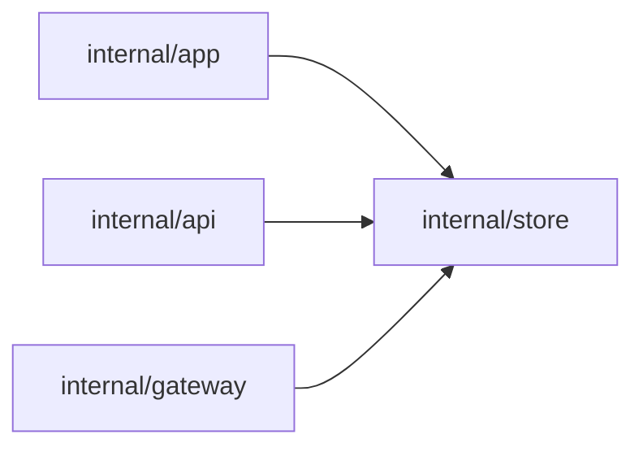

### 时序图

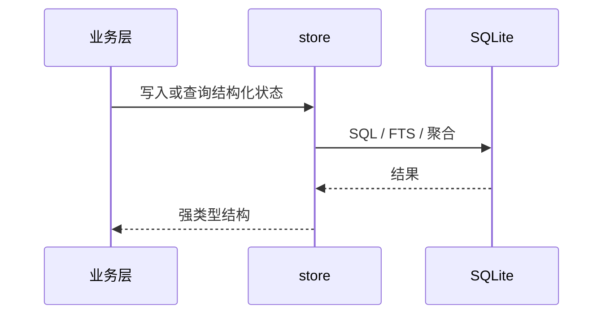

### 为什么这样设计

- 单机轻量版最适合 SQLite
- 把高价值轨迹结构化落库，后续恢复和审计才站得住

### Python 对应

- `hermes_state.py`
- gateway 会话镜像 / 状态存储链

---

## 5. `internal/llm` + `internal/models`

### 职责

- OpenAI-compatible 请求发送
- 原生 tool-calling
- model profile
- alias 解析
- 本地模型发现

### 架构图

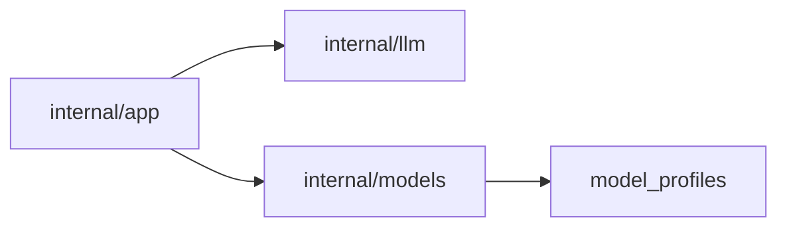

### 时序图

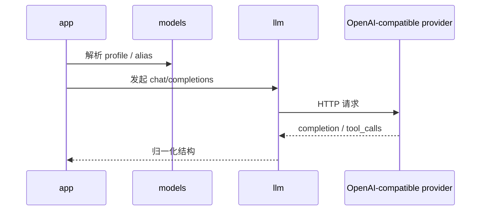

### 为什么这样设计

- 把 provider 差异收敛到 OpenAI-compatible 边界
- 让本地与远端模型都走同一套入口

### Python 对应

- `hermes_cli/models.py`
- `hermes_cli/model_switch.py`
- `agent/models_dev.py`

---

## 6. `internal/memory` + `internal/contextengine`

### 职责

- 文件记忆
- recalled memory 注入
- history window
- summary / compressor

### 架构图

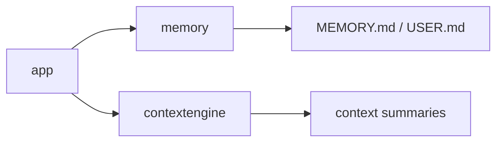

### 时序图

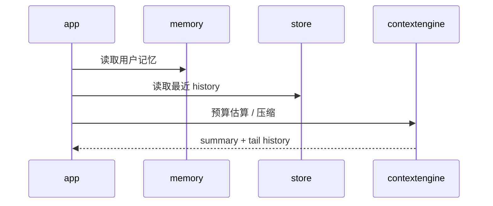

### 为什么这样设计

- 文件记忆容易理解
- 规则压缩容易审计
- 先做稳定，再逐步增强智能

### Python 对应

- `agent/context_compressor.py`
- `agent/prompt_builder.py` 中 memory/context 相关部分

---

## 7. `internal/tools`

### 职责

- 工具注册
- tool schema
- tool 执行
- child delegated tool 执行入口

### 架构图

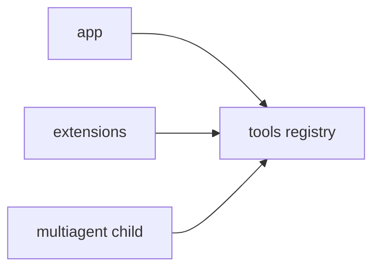

### 时序图

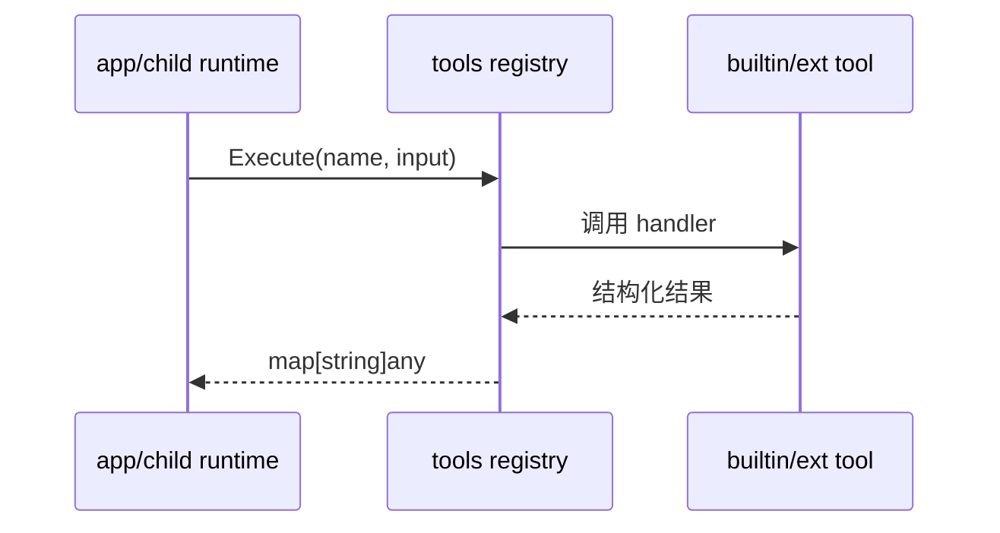

### 为什么这样设计

- 工具是 Agent 的能力边界
- 必须先注册、再暴露、再允许 child 使用

### Python 对应

- `tools/registry.py`
- `model_tools.py`
- `toolsets.py`

---

## 8. `internal/extensions`

### 职责

- plugin / skill / MCP 发现
- 工具注册
- 启停状态持久化
- lifecycle hook 执行

### 架构图

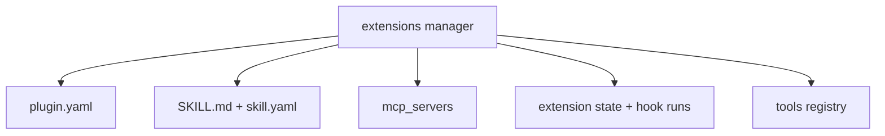

### 时序图

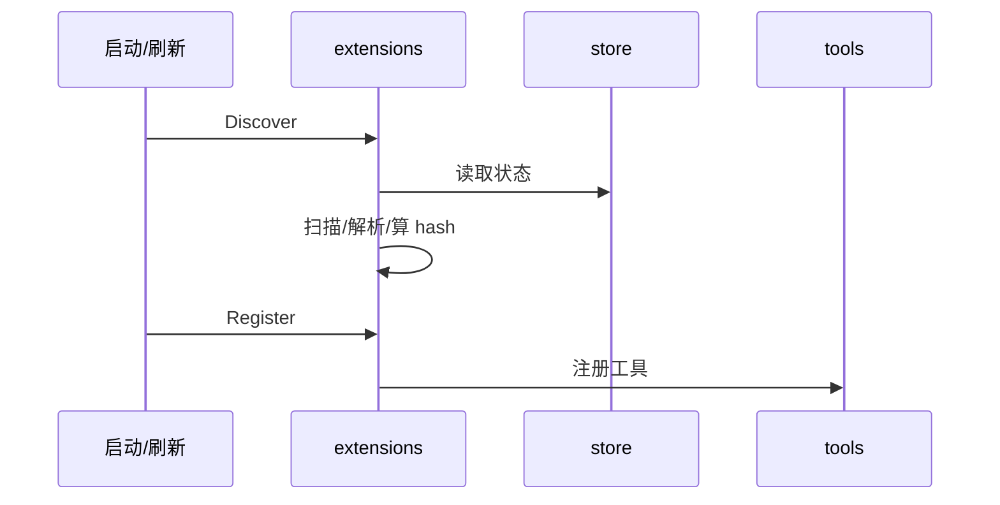

### 为什么这样设计

- 需要扩展能力，但不希望复制 Python 热加载的高风险形态

### Python 对应

- skills / plugins 生态
- `tools/mcp_tool.py`

---

## 9. `internal/multiagent`

### 职责

- plan
- policy
- orchestrator
- aggregate
- trace 结构

### 架构图

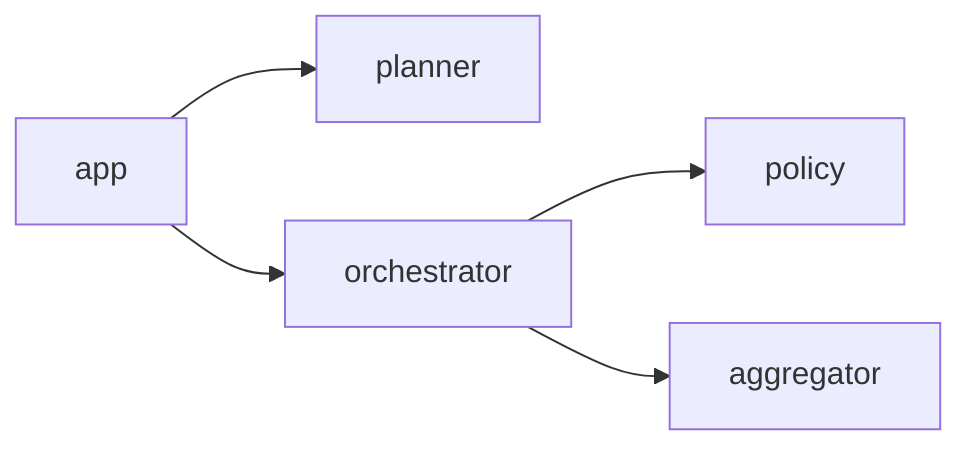

### 时序图

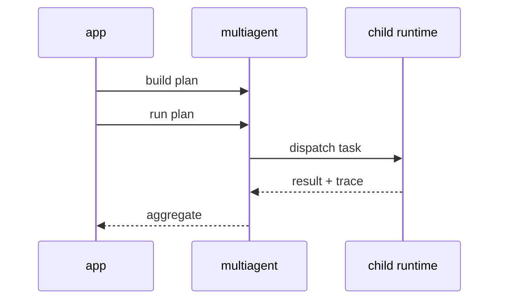

### 为什么这样设计

- 多 Agent 的核心是可控编排和恢复，而不是“更多线程”

### Python 对应

- `tools/delegate_tool.py`

---

## 10. `internal/execution`

### 职责

- `system.exec`
- `system.exec_profile`
- command allowlist
- approval / capability token / rollback

### 架构图

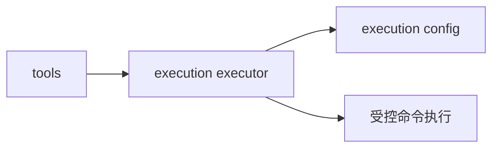

### 时序图

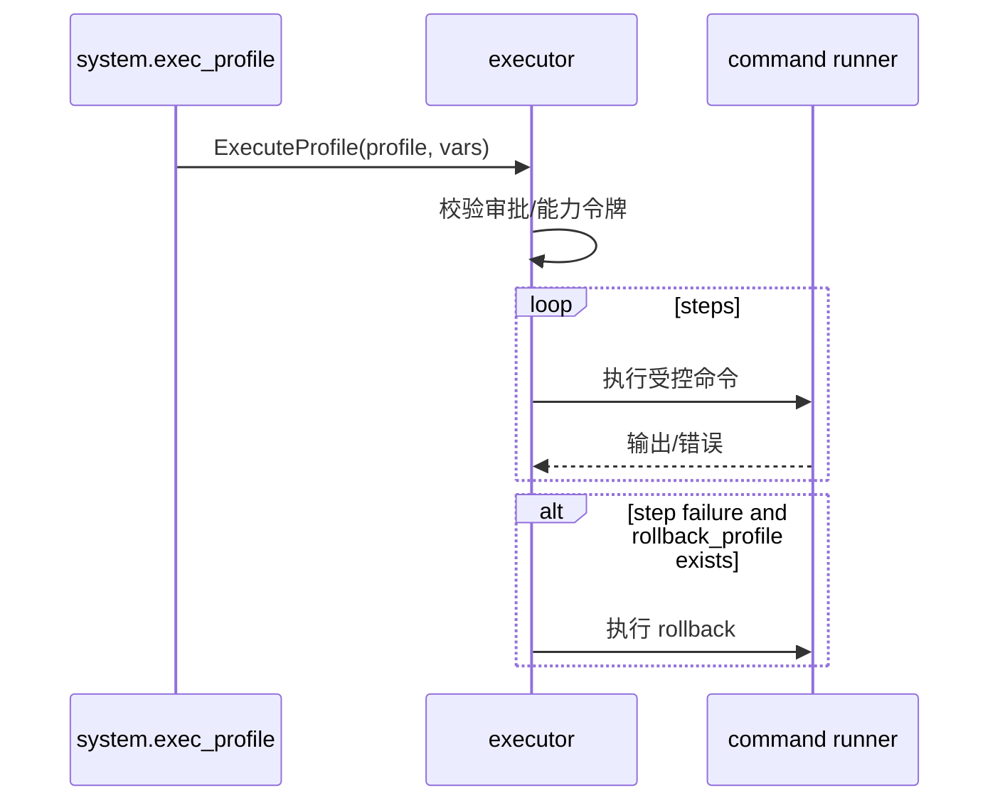

### 为什么这样设计

- 动态执行必须先治理，再追求灵活性

### Python 对应

- terminal / code execution / approval 主链中的受控执行思想

---

## 11. `internal/gateway`

### 职责

- webhook / telegram / slack 适配
- 命令路由
- 去重
- 回复发送

### 架构图

```mermaid
flowchart LR
    Platform[平台事件] --> GW[gateway adapter]
    GW --> APP[app]
    APP --> GW
    GW --> Platform
```

### 时序图

```mermaid
sequenceDiagram
    participant P as 外部平台
    participant GW as gateway
    participant APP as app

    P->>GW: webhook/event
    GW->>GW: 校验签名 / 去重 / 解析命令
    GW->>APP: chat or multiagent
    APP-->>GW: 文本结果
    GW-->>P: 平台回复
```

### 为什么这样设计

- 轻量版仍然要具备“被接入”的能力
- 但 gateway 不应该成为业务主脑

### Python 对应

- `gateway/run.py`
- `gateway/platforms/*`

---

## 12. `internal/config` + `internal/auth` + `internal/security`

### 职责

- 强类型配置
- 登录鉴权
- 密码哈希与 JWT

### 架构图

```mermaid
flowchart LR
    CLI/API --> AUTH[auth]
    AUTH --> SEC[security]
    APP --> CFG[config]
```

### 时序图

```mermaid
sequenceDiagram
    participant User as 用户
    participant API as CLI/API
    participant AUTH as auth
    participant SEC as security
    participant ST as store

    User->>API: 用户名/密码
    API->>AUTH: Login()
    AUTH->>ST: 查询用户
    AUTH->>SEC: 校验密码 / 签发 JWT
    AUTH-->>API: token
```

### 为什么这样设计

- 轻量版也必须有最小生产安全基线

### Python 对应

- `hermes_cli/auth.py`
- 本地配置与认证相关路径

---

## 13. 模块拆分总结

Go 版的模块拆分，本质上是在做三件事：

1. 把 Python 的动态能力收成显式边界
2. 把跨模块协调集中到 `internal/app`
3. 把高价值状态落进 `internal/store`

这三个决定，共同支撑了“轻量、易部署、易接入、易理解”的 Go 版本定位。
