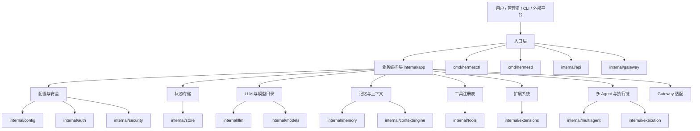
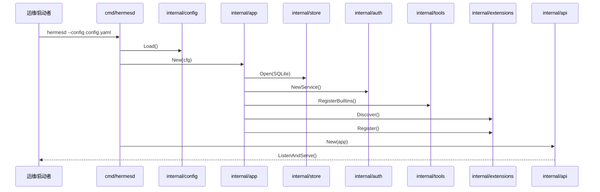
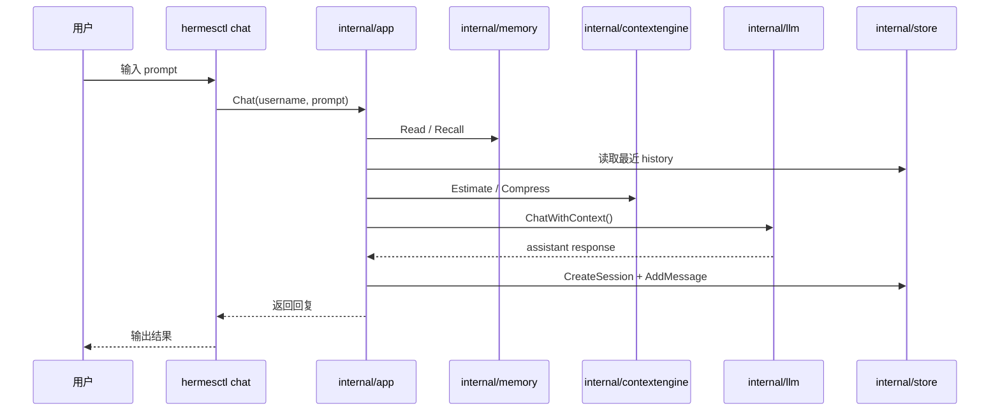
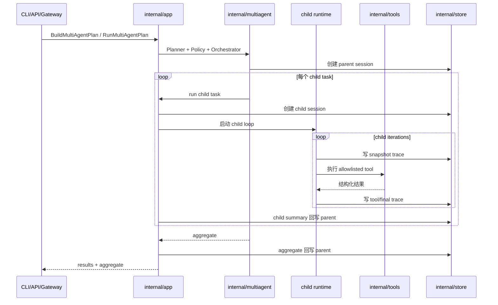
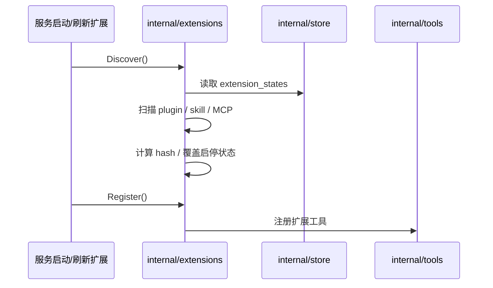

# Go Hermes 总体架构与时序

## 1. 版本定位

`go-hermes-agent` 的产品定义是：

- 轻量版
- 容易部署
- 容易接入
- 容易理解

这意味着 Go 版的优先级不是“复制 Python 所有动态能力”，而是：

1. 先建立稳定、可读、可测试的主干
2. 先把高频能力收口成显式契约
3. 先保证单机、CLI、API、多 Agent、扩展这些主链可运行
4. 对高风险能力采取受控迁移，而不是原样放开

## 2. 总体分层

## 3. 总体设计原则

### 3.1 显式优于动态

Python 版大量依赖运行时发现、动态注册、弱类型结构。  
Go 版改为：

- 显式配置
- 显式注册
- 显式结构体
- 显式接口

这样做的收益是：

- 代码更容易读
- 行为边界更清晰
- 测试更容易稳定

### 3.2 轻量优于完备

Go 版不是 Python 全功能平台的机械复制，而是有意识做裁剪：

- 先做 CLI 和 API 主链
- 先做 SQLite 单机状态
- 先做受控工具和受控扩展
- 先做可恢复的多 Agent 主干

### 3.3 可恢复优于纯功能堆叠

Go 版设计里，很多能力优先服务于“可恢复、可审计、可理解”：

- `sessions / messages`
- `audit_log`
- `multiagent_traces`
- `extension_hook_runs`
- `context_summaries`

这使得它更像一个可治理的 Agent Runtime，而不是仅靠自然语言拼接的黑盒。

## 4. 总体工作时序

### 4.1 服务启动时序

### 4.2 CLI 单轮对话时序

说明：

- 当前 Go 版交互控制台已经承载了大量 Python CLI 风格的 slash commands，不再只是单轮聊天壳。
- 默认普通聊天现在已经是控制台内持续会话：首次输入创建 session，后续输入继续追加到同一个 session。
- `/resume` 现在能把控制台切到指定 session，并让后续普通输入基于该 session 的最近消息继续续聊。

### 4.3 多 Agent 执行时序

### 4.4 扩展加载时序

## 5. 为什么整体这样设计

### 5.1 入口少

只保留两个稳定入口：

- `hermesd`
- `hermesctl`

这样使用者和后续维护者都不需要先理解一大堆启动模式。

### 5.2 编排集中

`internal/app` 承担“系统装配 + 跨模块协调”。  
这避免把业务分散到 API、Gateway、Tool、Extension 各层里。

### 5.3 存储集中

统一进 SQLite，而不是一部分进文件、一部分进日志、一部分进临时对象。  
这使 replay、resume、审计、搜索都比较自然。

### 5.4 高风险能力后置

Python 的浏览器自动化、自由代码执行、热插拔插件等能力非常强，但也很难治理。  
Go 版先把主干收紧，是为了让后续每一步扩展都能有边界。

## 6. 与 Python 原版的关系

Go 版不是逐文件翻译，而是按能力分层迁移：

- 保留：session、history、memory、tool calling、多 Agent 主干、扩展主干
- 调整：prompt / context / execution / extension lifecycle 的实现形态
- 延期：browser、完整 code execution、完整 cron、完整 ACP、完整 RL/Atropos

## 7. 当前最适合的使用方式

当前最推荐的 Go 使用方式是：

1. 单机部署
2. `hermesctl chat` 作为统一交互入口和运维控制台
3. `hermesd` 提供 API 和 webhook 扩展入口
4. 通过插件格式或后续平台适配做外部接入

这和“轻量、容易部署、容易接入、容易理解”的版本定义是一致的。
