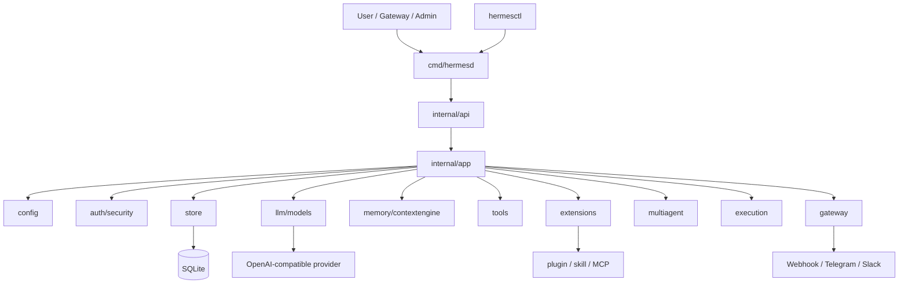
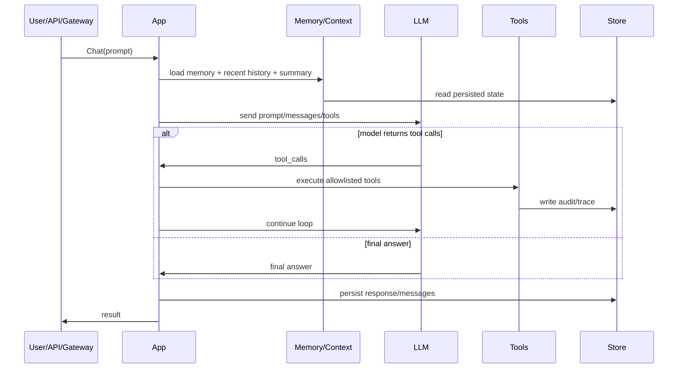
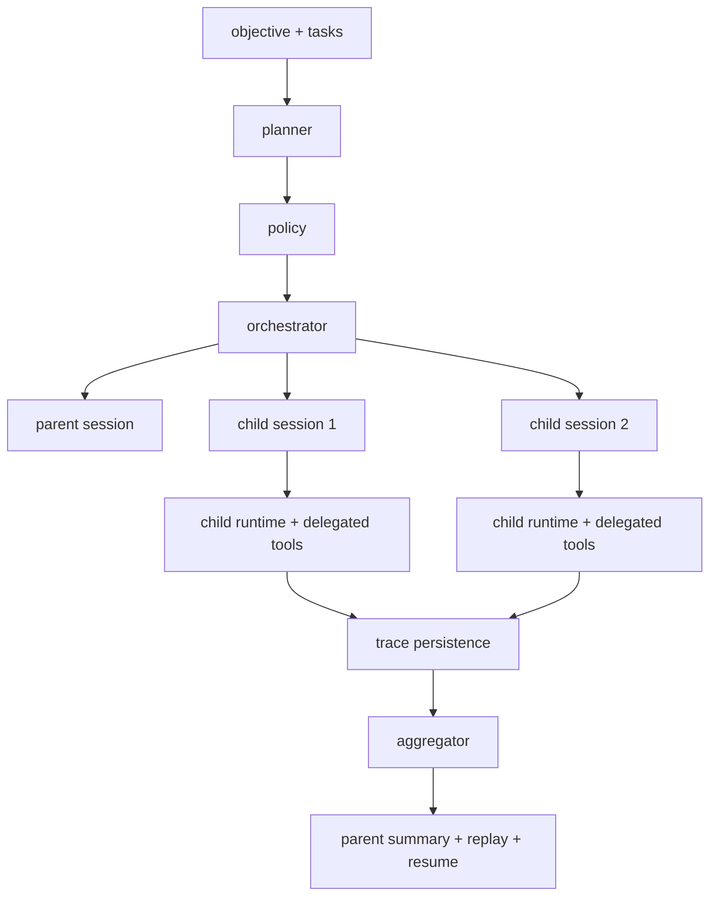
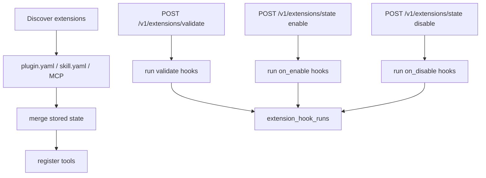

# go-hermes-agent 完整架构与复现说明

## 1. 文档定位

这是一份面向两类读者的总文档：

- 人：快速看懂 `go-hermes-agent` 到底包含什么、为什么这样设计、核心点在哪里
- AI 工具：按照这份文档，可以高相似度复现一套功能和结构基本一致的 Go Agent 系统

这份文档只保留一份总版本，目标是替代此前分散、重复的架构说明、流程图说明、优化说明和 Agent 概念说明。

---

## 2. go-hermes-agent 到底包含哪些部分

一个完整的 `go-hermes-agent` 当前由 10 个一级部分组成。

| 部分 | 目录 | 作用 | 当前状态 |
|---|---|---|---|
| 服务入口 | `cmd/hermesd` | 启动 HTTP API、gateway、运行时容器 | 已完成 |
| 管理入口 | `cmd/hermesctl` | 初始化管理员、模型切换、运维命令 | 已完成 |
| 配置与安全 | `internal/config` `internal/auth` `internal/security` | 配置加载、密码哈希、JWT、登录限制 | 已完成 |
| 状态存储 | `internal/store` | 用户、session、message、audit、trace、extension hook 持久化 | 已完成 |
| 模型边界 | `internal/llm` `internal/models` | OpenAI-compatible 调用、多模型 profile、本地模型发现 | 已完成基础版 |
| 记忆与上下文 | `internal/memory` `internal/contextengine` | 文件记忆、回忆注入、history window、summary/compressor | 已完成第一阶段 |
| 工具系统 | `internal/tools` | 工具注册、受限工具执行、tool schema 暴露 | 已完成受限版 |
| 动态扩展 | `internal/extensions` | plugin、skill、MCP、lifecycle hooks | 已完成受控版 |
| 平台入口 | `internal/api` `internal/gateway` | REST API、Webhook、Telegram、Slack | 已完成基础平台版 |
| 多 Agent 与执行链 | `internal/multiagent` `internal/execution` `internal/app` | parent/child 编排、trace、resume、受控 exec profile | 已完成主干版 |

换句话说，当前 Go 版已经不是一个“单轮聊天 demo”，而是一套真正的 Agent 工程骨架。

---

## 3. 每个部分采用了什么方案，为什么采用这些方案

### 3.1 服务入口与 CLI

采用方案：

- `hermesd` 负责运行服务
- `hermesctl` 负责初始化和管理
- `scripts/install.sh` / `scripts/uninstall.sh` 负责安装卸载

为什么这样做：

- Go 天然适合交付成单独二进制
- 运维动作显式，学习成本低
- 方便做“一键安装、一键卸载、最少命令启动”

优势：

- 适合本地、内网、单机部署
- 不依赖 Python 运行时知识
- 容易脚本化、容器化

### 3.2 配置与安全

采用方案：

- `config.yaml`
- 环境变量注入密钥
- `bcrypt`
- JWT
- 登录失败限制

为什么这样做：

- YAML 便于人读写
- 密钥与配置分离
- 这是最小但完整的生产安全基线

优势：

- 结构简单
- 易验证
- 易迁移
- 易运维

### 3.3 状态存储

采用方案：

- SQLite
- FTS5
- 审计表、轨迹表、扩展 hook 结果表

为什么这样做：

- 先做单机版，降低依赖
- SQLite 足够支撑当前的 session / history / audit / trace 需求
- FTS5 能解决“消息检索”而不引入额外搜索引擎

优势：

- 零外部依赖
- 可快速备份迁移
- 容易做 replay / resume / 审计

### 3.4 模型边界

采用方案：

- OpenAI-compatible 统一客户端
- `model_profiles`
- alias
- 本地模型发现

为什么这样做：

- 现实里 OpenAI-compatible 已是事实标准
- 同一接口可以接 OpenAI、OpenRouter、Ollama、LM Studio、vLLM、LocalAI
- 减少 provider 特化代码

优势：

- 切模型成本低
- 本地/远端统一抽象
- 后续继续扩 provider 更容易

### 3.5 记忆与上下文

采用方案：

- `MEMORY.md` / `USER.md`
- recalled memory
- history window
- 规则型摘要压缩
- 持久化 summary

为什么这样做：

- 先用稳定、可解释的记忆模型
- 先控制上下文成本，再追求更复杂的 memory intelligence

优势：

- 人可读
- 容易调试
- 容易做“为什么模型这么回答”的追踪

### 3.6 工具系统

采用方案：

- 编译期注册
- registry allowlist
- 结构化 tool schema
- child runtime 中受限 delegated tools

为什么这样做：

- Go 不适合 Python 那类热注册魔法
- 显式工具集更适合审计、测试和权限控制

优势：

- 知道系统里到底有哪些工具
- child agent 不容易越权
- schema 可直接喂给 LLM

### 3.7 动态扩展

采用方案：

- `plugin.yaml`
- `skill.yaml`
- `SKILL.md`
- `mcp_servers`
- `validate / on_enable / on_disable`

为什么这样做：

- 保留扩展生态
- 但不复制 Python 的任意热加载风险

优势：

- 扩展是声明式的
- 可启停、可验证、可审计
- MCP、本地脚本、技能脚本统一纳入治理

### 3.8 Gateway

采用方案：

- 通用 webhook
- Telegram webhook
- Slack slash command + events
- update/event dedupe
- 最小会话隔离

为什么这样做：

- Agent 不是只服务 API，也要服务真实消息平台
- 去重、签名、回复、路由都是平台接入必须能力

优势：

- 可直接对接真实平台
- 平台逻辑和业务逻辑解耦
- `/multiagent ...` 已能从 gateway 进入主链

### 3.9 多 Agent

采用方案：

- `planner`
- `policy`
- `orchestrator`
- `aggregator`
- parent/child session
- trace
- replay / resume

为什么这样做：

- 多 Agent 最核心不是“并发”，而是“可控编排 + 可恢复”
- parent/child session 是最适合工程落地的结构

优势：

- 轨迹清晰
- 可恢复
- 可审计
- child 可隔离上下文和工具权限

### 3.10 动态执行链

采用方案：

- `system.exec`
- `system.exec_profile`
- allowlist command
- per-command rule
- `require_approval`
- `capability_token`
- `rollback_profile`

为什么这样做：

- 真正危险的是执行链，不是文本生成
- 直接放开 shell 是不可治理的
- 所以需要从“受控 profile”开始

优势：

- 动态能力更强
- 但仍然在治理边界内
- 可作为 child delegated runtime 的安全执行底座

---

## 4. 代码整体设计

### 4.1 总体设计图

### 4.2 设计原则

代码整体遵循 6 个原则：

1. `internal/app` 统一装配  
   业务协调尽量收口到 `app`

2. 入口层只做适配  
   `api`、`gateway` 不承担核心业务逻辑

3. 状态可持久化  
   session、audit、trace、hook result 都进入 SQLite

4. 高风险能力默认收口  
   不直接把 Python 的高动态执行能力平移过来

5. 多 Agent 优先可恢复  
   先做 trace / replay / resume，再做更强自治

6. 扩展优先可治理  
   先做声明式、白名单、lifecycle、审计

---

## 5. 运行流程

### 5.1 Chat 主流程

### 5.2 Multi-Agent 主流程

### 5.3 扩展生命周期流程

---

## 6. 最核心的点

如果只抓最关键的工程点，Go 版的核心是下面 8 项：

### 6.1 `internal/app` 是唯一业务协调核心

所有真正的业务主线都应尽量从这里经过：

- chat
- memory/context
- extensions
- multiagent
- execution

这是理解整个系统的第一入口。

### 6.2 不是“自由插件系统”，而是“受控扩展系统”

扩展不是直接把代码注入主链，而是：

- 先声明
- 再发现
- 再校验
- 再注册
- 再执行
- 再审计

### 6.3 多 Agent 的关键不是并行，而是恢复

当前 Go 版做得最像工程系统的地方，是它已经有：

- child trace
- replay
- resume
- recovered assistant/tool history
- child session / parent session

这比“多个 worker 同时跑”更有价值。

### 6.4 工具系统是 LLM 与系统能力之间的唯一桥

无论是：

- `session.search`
- `memory.read`
- `system.exec_profile`
- `mcp.<server>.<tool>`

最终都要通过 tool registry 进入系统。

### 6.5 执行链采用受控 profile，而不是任意 shell

这是当前 Go 版最关键的安全取舍之一。

### 6.6 生命周期 hooks 已经进入治理闭环

现在扩展不是“开/关”两个状态，而是：

- validate
- enable
- disable
- hook result persistence
- hook result API

### 6.7 Gateway 是入口适配层，不是业务层

平台适配应尽量保持轻薄，核心业务留在 `app`。

### 6.8 SQLite 不只是“存聊天”，而是系统运行状态仓

它已经承担了：

- users
- sessions
- messages
- FTS
- audit
- processed gateway updates
- extension states
- extension hook runs
- multiagent traces

---

## 7. 为了让 AI 工具也能复现，这份文档必须提供什么

如果希望其他 AI 工具根据文档实现一个高度相似的 Agent，文档必须提供“复现契约”，而不只是概念。

### 7.1 复现契约：目录结构

最少应包含：

- `cmd/hermesd`
- `cmd/hermesctl`
- `internal/app`
- `internal/config`
- `internal/auth`
- `internal/security`
- `internal/store`
- `internal/llm`
- `internal/models`
- `internal/memory`
- `internal/contextengine`
- `internal/tools`
- `internal/extensions`
- `internal/multiagent`
- `internal/execution`
- `internal/gateway`
- `configs/`
- `scripts/`
- `docs/`

### 7.2 复现契约：核心数据表

至少应有：

- `users`
- `sessions`
- `messages`
- `messages_fts`
- `audit_log`
- `processed_gateway_updates`
- `extension_states`
- `extension_hook_runs`
- `context_summaries`
- `multiagent_traces`

### 7.3 复现契约：核心 API

至少应有：

- `/auth/login`
- `/v1/chat`
- `/v1/context`
- `/v1/memory`
- `/v1/history`
- `/v1/search`
- `/v1/tools`
- `/v1/tools/execute`
- `/v1/extensions`
- `/v1/extensions/refresh`
- `/v1/extensions/state`
- `/v1/extensions/validate`
- `/v1/extensions/hooks`
- `/v1/models`
- `/v1/models/discover`
- `/v1/models/switch`
- `/v1/multiagent/plan`
- `/v1/multiagent/run`
- `/v1/multiagent/traces`
- `/v1/multiagent/traces/summary`
- `/v1/multiagent/traces/failures`
- `/v1/multiagent/traces/hotspots`
- `/v1/multiagent/replay`
- `/v1/multiagent/resume`
- `/v1/audit`
- `/v1/audit/execution`
- `/gateway/webhook`
- `/gateway/telegram/webhook`
- `/gateway/slack/command`
- `/gateway/slack/events`

### 7.4 复现契约：tool contract

必须满足：

- 工具统一注册
- 工具统一列表输出
- 工具统一 schema 暴露
- child runtime 只允许 allowlisted tools
- 工具调用必须审计

### 7.5 复现契约：multiagent contract

必须满足：

- parent session
- child session
- per-child trace
- replay
- resume
- tool-calling 优先，JSON fallback
- delegated tools allowlist

只要这几条契约都满足，其他 AI 工具就能复现出一套行为高度相似的 Go Agent。

---

## 8. 结合论文，对当前 Go 版已经实际落地的优化

这里不列“空泛理论”，只列已经映射到 Go 代码的方向。

### 8.1 Memory 与 context 分层

参考：

- *A Survey on the Memory Mechanism of Large Language Model based Agents*  
  <https://arxiv.org/abs/2404.13501>
- *MemGPT*  
  <https://arxiv.org/abs/2310.08560>

落地点：

- 文件记忆
- recalled memory
- history window
- persisted summary
- compressor

### 8.2 Planning / Execution 分离

参考：

- *Understanding the planning of LLM agents*  
  <https://arxiv.org/abs/2402.02716>
- *The Landscape of Emerging AI Agent Architectures*  
  <https://arxiv.org/abs/2404.11584>

落地点：

- planner
- policy
- orchestrator
- aggregator

### 8.3 Tool-use 工程化

参考：

- *ReAct*  
  <https://arxiv.org/abs/2210.03629>
- *AgentBench*  
  <https://arxiv.org/abs/2308.03688>

落地点：

- tool registry
- native tool-calling 优先
- delegated tools allowlist
- execution profile

### 8.4 Safety-first Agent runtime

参考：

- *Evil Geniuses*  
  <https://arxiv.org/abs/2311.11855>
- *Breaking ReAct Agents*  
  <https://arxiv.org/abs/2410.16950>

落地点：

- default deny execution
- allowlist tools
- audit
- trace
- approval / capability token / rollback profile
- lifecycle hook governance

---

## 9. 当前最适合继续优化的方向

虽然这份文档已经足够复现当前版本，但如果要进一步逼近更强的 Agent 系统，下一步价值最高的是：

1. 更完整的 child loop state snapshot
2. 更多安全 delegated tools
3. execution profile 的更细粒度审批与回滚策略
4. lifecycle hook 的 summary / failure 分析视图
5. 更多 gateway 平台
6. 更丰富的 memory provider 生态

---

## 10. 结论

如果只用一句话定义当前 `go-hermes-agent`：

它是一套以 Go 为核心、以安全主干为先、具备多 Agent、可恢复、可审计、可扩展、可接真实平台消息的 Agent 工程系统。

如果只用一句话定义这份文档的目标：

它不是“介绍项目”，而是给人和 AI 一份可以直接照着复现系统的实现说明书。

---

## 11. 参考

- `go/README.md`
- `go/docs/analysis/`
- `go/docs/migration/`
- `go/docs/security/`
- *A Survey on the Memory Mechanism of Large Language Model based Agents*  
  <https://arxiv.org/abs/2404.13501>
- *Understanding the planning of LLM agents*  
  <https://arxiv.org/abs/2402.02716>
- *The Landscape of Emerging AI Agent Architectures*  
  <https://arxiv.org/abs/2404.11584>
- *Large Language Model Agent: A Survey on Methodology, Applications and Challenges*  
  <https://arxiv.org/abs/2503.21460>
- *MemGPT*  
  <https://arxiv.org/abs/2310.08560>
- *ReAct*  
  <https://arxiv.org/abs/2210.03629>
- *AgentBench*  
  <https://arxiv.org/abs/2308.03688>
- *Evil Geniuses*  
  <https://arxiv.org/abs/2311.11855>
- *Breaking ReAct Agents*  
  <https://arxiv.org/abs/2410.16950>
